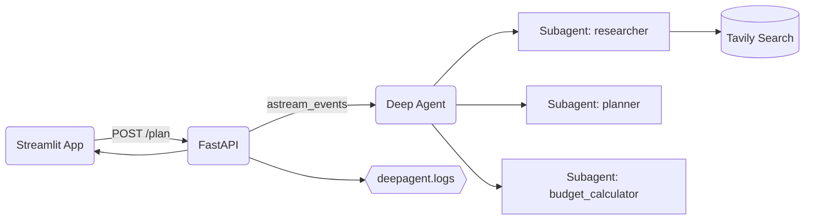

# ✈️ Deep Tour Agent

  

A Streamlit + FastAPI application powered by DeepAgents for planning beautiful, practical itineraries. It researches options, proposes multiple plans, and—after your selection—finalizes the itinerary and calculates a budget.

---

## 🌟 Highlights
- Streamed planning updates and live observability logs
- Subagents for researcher, planner, and budget calculation
- `.env`-driven configuration for API keys and model
- Stable sequential Phase 2: planner runs first, then budget calculator
- Single-file logs at `deepagent.logs`

---

## 🎬 Animations & 📸 Pics

  

  

  

Replace the links above with your own assets if you prefer. Remote image/GIF links are supported by GitHub markdown.

---

## 🧭 Architecture

- UI: `app.py` calls `POST /plan` and renders streamed logs and final answer
- API: `tour_assist/api.py` streams NDJSON events and writes file logs
- Agents: `tour_assist/agents.py` builds the Deep Agent and subagents
- Tools: `tour_assist/tools.py` provides `internet_search` via Tavily

---

## 🚀 Quickstart

- Prerequisites: Python runtime at `deepagent_1/` and `.env` keys set
- Backend:
  - `& "c:\work\Deep Agent\deepagent_1\Scripts\python.exe" -m uvicorn tour_assist.api:app --host localhost --port 8001 --reload`
- Frontend:
  - `$env:API_BASE='http://localhost:8001'; & "c:\work\Deep Agent\deepagent_1\Scripts\python.exe" -m streamlit run app.py`
- Open the app:
  - `http://localhost:8501/`

---

## 🔧 Configuration

- `.env` keys:
  - `OPENAI_API_KEY` — required
  - `TAVILY_API_KEY` — optional but recommended
  - `MODEL_NAME` or `model` — e.g., `gpt-4.1-mini` Use any model supported by OpenAI
  - `API_BASE` — e.g., `http://localhost:8001`

---

## 📡 API

- `GET /health` — returns `{"status":"ok"}`
- `POST /plan` — NDJSON streaming endpoint
  - Request body: `{ "messages": [{"role":"user","content":"..."}, ...] }`
  - Streamed event lines:
    - `{ "type": "log", "message": "..." }`
    - `{ "type": "answer", "content": "..." }`
    - `{ "type": "error", "message": "..." }`

---

## 🧠 Agent Protocol

- Phase 1 (Propose): research and present 3 options
- Phase 2 (Finalize): after selection, run subagents sequentially
  - Planner creates the detailed itinerary
  - Budget calculator estimates totals and breakdowns

This project enforces sequential execution in Phase 2 to avoid concurrent graph updates.

---

## 📝 Logs

- Path: `deepagent.logs`
- Includes: start plan, subagent spawns, tool usage, final answer, errors

---

## ✨ Tips

- Replace image/GIF links with your brand assets
- Use `.env` to set `API_BASE` for consistent client routing
- If you see 404 on `/plan`, ensure the backend port matches `API_BASE`

  

